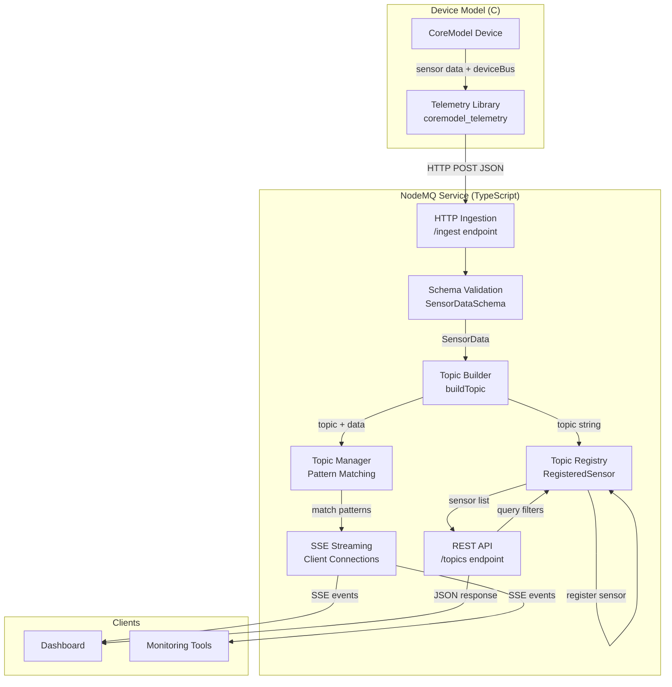

# Design Document: Generic Telemetry Bus Support

## Overview

This feature transforms the telemetry system from a hardcoded, bus-specific architecture to a fully generic, extensible system that automatically handles telemetry data from any device bus type without code changes. The design eliminates all hardcoded bus type lists, enums, and conditional logic, replacing them with dynamic string-based routing and discovery.

The system consists of two main components:
1. **C Telemetry Library** (coremodel_telemetry.c/h) - Embedded in device models, accepts deviceBus as a string parameter
2. **NodeMQ Service** - HTTP ingestion server with SSE streaming, dynamically creates topics and routes messages

When a device model sends telemetry data with a deviceBus field (e.g., "spi0", "i2c1", "can0"), the system automatically:
- Creates an MQTT-style topic: `sensors/{modelId}/{deviceBus}/{sensorType}/{sensorId}[/{type}]`
- Registers the sensor in the topic registry with all metadata
- Routes messages to subscribers matching the topic pattern
- Exposes the deviceBus for filtering and discovery via REST API

This enables dashboard developers to discover and subscribe to any telemetry stream without knowing bus types in advance, and device model developers to add new hardware interfaces without modifying the telemetry system.

## Architecture

### System Components



### Data Flow

1. **Ingestion**: Device model calls C library function with deviceBus parameter
2. **Serialization**: C library creates JSON payload with deviceBus field
3. **Validation**: NodeMQ validates against SensorDataSchema (deviceBus optional string)
4. **Topic Creation**: buildTopic() constructs hierarchical topic including deviceBus
5. **Registration**: TopicRegistry stores sensor with deviceBus metadata
6. **Routing**: TopicManager matches topic against subscriber patterns
7. **Delivery**: SSE streams deliver messages to matching clients
8. **Discovery**: REST API exposes registered sensors with deviceBus filters

### Topic Structure

```
sensors/{sourceModelId}/{deviceBus}/{sensorType}/{sensorId}[/{type}]
```

Examples:
- `sensors/max30001-demo/spi0/PSTAT/ecg-sensor`
- `sensors/max30001-demo/spi0/PSTAT/ecg-sensor/fifoPush`
- `sensors/vehicle-model/can0/speed/wheel-sensor`
- `sensors/uart-device/uart2/gps/location-sensor`
- `sensors/legacy-model/default/temperature/temp-sensor` (backward compatible)

### Wildcard Subscription Patterns

Clients can subscribe using MQTT-style wildcards:
- `sensors/#` - All sensors from all buses
- `sensors/+/spi0/#` - All SPI0 sensors from any model
- `sensors/max30001-demo/+/#` - All buses from specific model
- `sensors/+/can0/speed/+` - All speed sensors on CAN0 from any model

## Components and Interfaces

### C Library Changes

#### Modified Functions

The C library needs minimal changes - primarily accepting deviceBus as an optional parameter and including it in JSON payloads.

**Function Signature Pattern**:
```c
int coremodel_telemetry_send_xxx(
    coremodel_telemetry_t *telem,
    const char *sensor_type,
    <value_parameters>,
    const char *device_bus  // NEW: optional, can be NULL
);
```

**JSON Payload Format**:
```json
{
  "sensorId": "ecg-sensor",
  "sensorType": "PSTAT",
  "sourceModelId": "max30001-demo",
  "deviceBus": "spi0",
  "value": { ... },
  "timestamp": 1234567890
}
```

When `device_bus` is NULL or empty string, the field is omitted from JSON (NodeMQ defaults to "default").

#### Implementation Strategy

1. Add `device_bus` parameter to all send functions
2. Store `device_bus` in the telemetry struct (optional)
3. Include `deviceBus` field in JSON only when non-empty
4. No validation or restriction on deviceBus values
5. Maintain backward compatibility (NULL deviceBus works)

### NodeMQ Service Changes

#### Schema Updates (src/types/sensor-data.ts)

**Current Schema**:
```typescript
export const SensorDataSchema = z.object({
  sensorId: z.string().min(1),
  sensorType: z.union([z.string().min(1), z.array(z.string().min(1))]),
  value: z.union([...]),
  sourceModelId: z.string().min(1),
  deviceBus: z.string().min(1).optional(),  // ALREADY EXISTS
  timestamp: z.union([z.string().datetime(), z.number()]).optional(),
  metadata: z.record(z.unknown()).optional(),
  type: z.array(z.string()).optional(),
});
```

**No schema changes needed** - deviceBus is already optional string without enum constraints.

#### Topic Building (src/types/ingested-message.ts)

**Current Implementation**:
```typescript
export function buildTopic(
  modelId: string,
  sensorType: string | string[],
  sensorId: string,
  deviceBus?: string,
  value?: SensorData['value'],
): string {
  const bus = deviceBus ?? 'default';
  const type = Array.isArray(sensorType) ? sensorType[0] : sensorType;
  const base = `sensors/${modelId}/${bus}/${type}/${sensorId}`;
  // ... type logic
}
```

**No changes needed** - already handles deviceBus generically with "default" fallback.

#### Topic Registry (src/services/topic-registry.ts)

**Current RegisteredSensor Type**:
```typescript
export const RegisteredSensorSchema = z.object({
  topic: z.string().min(1),
  sensorId: z.string().min(1),
  sensorType: z.union([z.string().min(1), z.array(z.string().min(1))]),
  sourceModelId: z.string().min(1),
  deviceBus: z.string().min(1),  // ALREADY EXISTS
  type: z.string().optional(),
  lastSeen: z.string().datetime(),
  messageCount: z.number().int().nonnegative(),
  lastValue: z.unknown().optional(),
  registrationMetadata: z.object({
    type: z.array(z.string()).optional(),
  }).optional(),
});
```

**Current Filter Support**:
```typescript
export interface SensorFilterCriteria {
  sourceModelId?: string;
  sensorType?: string;
  deviceBus?: string;  // ALREADY EXISTS
  type?: string;
}

export type SensorFilterField = 'sourceModelId' | 'sensorType' | 'deviceBus' | 'type';
```

**No changes needed** - deviceBus is already tracked, filterable, and extractable.

#### REST API (src/index.ts or routes)

**Current /topics Endpoint**:
The endpoint already returns registered sensors with deviceBus field and supports filtering.

**Expected Response Format**:
```json
{
  "sensors": [
    {
      "topic": "sensors/max30001-demo/spi0/PSTAT/ecg-sensor",
      "sensorId": "ecg-sensor",
      "sensorType": "PSTAT",
      "sourceModelId": "max30001-demo",
      "deviceBus": "spi0",
      "lastSeen": "2024-01-15T10:30:00Z",
      "messageCount": 42
    }
  ],
  "filters": {
    "sourceModelId": ["max30001-demo", "vehicle-model"],
    "sensorType": ["PSTAT", "speed", "temperature"],
    "deviceBus": ["spi0", "can0", "uart2", "default"],
    "type": ["fifoPush", "spiRead", "generate"]
  },
  "suggestedPatterns": [
    "sensors/#",
    "sensors/max30001-demo/#",
    "sensors/+/spi0/#",
    "sensors/+/can0/#"
  ]
}
```

**No changes needed** - existing implementation already supports this.

### Removal of Hardcoded Bus Types

**Files to Audit**:
1. src/types/sensor-data.ts - Check for bus type enums or sets
2. src/types/ingested-message.ts - Verify no bus-specific branching
3. src/services/topic-registry.ts - Ensure generic string handling
4. src/services/topic-manager.ts - Verify pattern matching is generic
5. Any route handlers - Remove bus type validation lists

**Pattern to Remove**:
```typescript
// BAD: Hardcoded bus type list
const VALID_BUS_TYPES = ['spi', 'i2c', 'gpio', 'can'];

// BAD: Bus-specific conditional logic
if (deviceBus === 'spi') {
  // special handling
} else if (deviceBus === 'i2c') {
  // different handling
}

// BAD: Enum constraints
const BusTypeSchema = z.enum(['spi', 'i2c', 'gpio']);
```

**Pattern to Keep**:
```typescript
// GOOD: Generic string handling
const bus = deviceBus ?? 'default';
const topic = `sensors/${modelId}/${bus}/${sensorType}/${sensorId}`;

// GOOD: No validation beyond non-empty
deviceBus: z.string().min(1).optional()
```

## Data Models

### SensorData (TypeScript)

```typescript
interface SensorData {
  sensorId: string;                    // Required, non-empty
  sensorType: string | string[];       // Required, non-empty
  value?: number | string | boolean | object;  // Optional, any JSON type
  sourceModelId: string;               // Required, non-empty
  deviceBus?: string;                  // Optional, any non-empty string
  timestamp?: string | number;         // Optional, ISO datetime or ms epoch
  metadata?: Record<string, unknown>;  // Optional, arbitrary metadata
  type?: string[];                     // Optional, measurement types
}
```

### RegisteredSensor (TypeScript)

```typescript
interface RegisteredSensor {
  topic: string;                       // Full topic path
  sensorId: string;                    // Sensor identifier
  sensorType: string | string[];       // Sensor type(s)
  sourceModelId: string;               // Source model ID
  deviceBus: string;                   // Device bus (never undefined in registry)
  type?: string;                       // type/stream type
  lastSeen: string;                    // ISO datetime of last message
  messageCount: number;                // Total messages received
  lastValue?: unknown;                 // Last value received
  registrationMetadata?: {
    type?: string[];                   // Measurement types from registration
  };
}
```

### IngestedMessage (TypeScript)

```typescript
interface IngestedMessage {
  messageId: string;                   // Unique message ID
  timestamp: string;                   // ISO datetime of ingestion
  data: SensorData;                    // Original sensor data
  topic: string;                       // Computed topic path
}
```

### C Library Payload (JSON)

```json
{
  "sensorId": "string",
  "sensorType": "string",
  "sourceModelId": "string",
  "deviceBus": "string",
  "value": <any>,
  "timestamp": <number>
}
```

Field `deviceBus` is optional - omitted when NULL/empty in C code.

