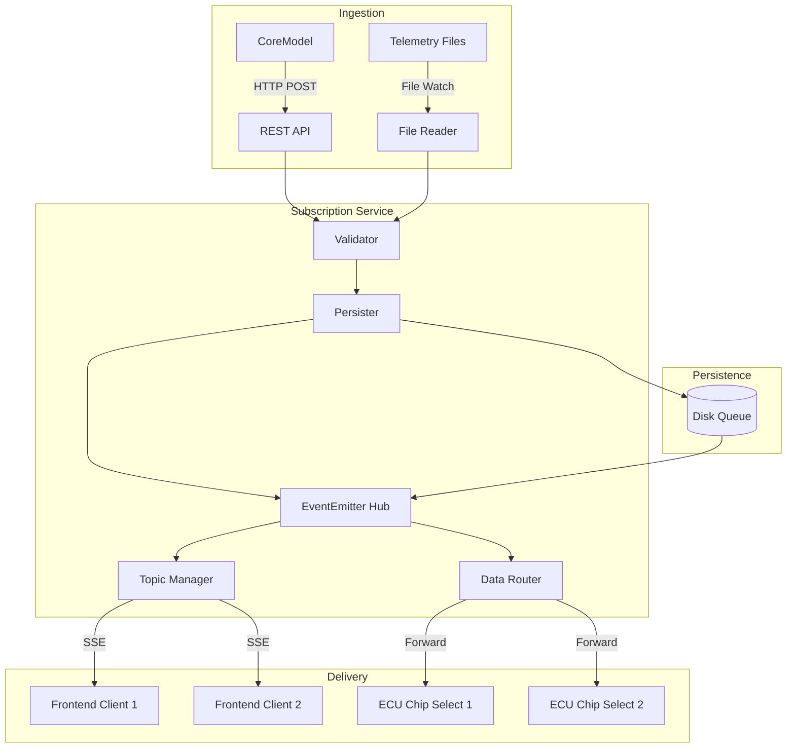

# Design Document: Sensor Subscription Service

## Overview

The Sensor Subscription Service is a Node.js/TypeScript application that acts as a real-time data hub for Corellium sensor data. It receives sensor readings from CoreModel devices, streams them to frontend clients via Server-Sent Events (SSE), and forwards data to ECU chip selects on designated models.

The architecture follows an event-driven pattern using Node.js EventEmitter for internal message routing, with disk persistence for reliability and an MQTT-style hierarchical topic system for flexible data filtering.

## Architecture



## Components and Interfaces

### 1. Sensor Data Ingestion Component

Handles incoming sensor data from CoreModel devices and telemetry files.

```typescript
interface SensorData {
  sensorId: string;
  sensorType: string;
  value: number | string | boolean | object;
  sourceModelId: string;
  timestamp?: string;
  metadata?: Record<string, unknown>;
}

interface IngestedMessage {
  messageId: string;
  timestamp: string;
  data: SensorData;
  topic: string;
}

interface IngestionResult {
  success: boolean;
  messageId?: string;
  error?: string;
}

interface SensorIngestionService {
  ingest(data: unknown): Promise<IngestionResult>;
  validateSensorData(data: unknown): SensorData | null;
}
```

### 2. Topic Manager Component

Manages MQTT-style hierarchical topics with wildcard support.

```typescript
interface TopicSubscription {
  clientId: string;
  pattern: string;
  isWildcard: boolean;
}

interface TopicManager {
  subscribe(clientId: string, topicPattern: string): void;
  unsubscribe(clientId: string, topicPattern: string): void;
  unsubscribeAll(clientId: string): void;
  getMatchingSubscribers(topic: string): string[];
  matchTopic(pattern: string, topic: string): boolean;
  buildTopic(modelId: string, sensorType: string, sensorId: string): string;
}
```

Topic format: `sensors/{modelId}/{sensorType}/{sensorId}`

Wildcard support:
- `+` matches exactly one level: `sensors/+/temperature/+`
- `#` matches zero or more levels: `sensors/model1/#`

### 3. SSE Connection Manager Component

Manages Server-Sent Events connections for frontend clients.

```typescript
interface SSEClient {
  clientId: string;
  response: ServerResponse;
  connectedAt: Date;
  subscriptions: Set<string>;
}

interface SSEConnectionManager {
  addClient(clientId: string, response: ServerResponse): void;
  removeClient(clientId: string): void;
  sendToClient(clientId: string, event: string, data: unknown): boolean;
  broadcast(topic: string, data: unknown): void;
  startHeartbeat(intervalMs: number): void;
  getClientCount(): number;
}
```

### 4. Data Router Component

Routes sensor data to ECU chip selects based on configuration.

```typescript
interface ChipSelectConfig {
  modelId: string;
  chipSelectAddress: number;
  sensorTypes: string[];
}

interface ECUTarget {
  modelId: string;
  chipSelectAddress: number;
}

interface ForwardResult {
  success: boolean;
  target: ECUTarget;
  error?: string;
  retryCount?: number;
}

interface DataRouter {
  forward(message: IngestedMessage): Promise<ForwardResult[]>;
  getTargetsForSensor(sensorType: string): ECUTarget[];
  updateConfig(config: ChipSelectConfig[]): void;
}
```

### 5. Message Persistence Component

Handles disk-based message persistence and recovery.

```typescript
interface PersistedMessage {
  messageId: string;
  data: IngestedMessage;
  status: 'pending' | 'processing' | 'completed' | 'failed';
  retryCount: number;
  createdAt: string;
  updatedAt: string;
}

interface MessagePersistence {
  persist(message: IngestedMessage): Promise<string>;
  markCompleted(messageId: string): Promise<void>;
  markFailed(messageId: string): Promise<void>;
  getPendingMessages(): Promise<PersistedMessage[]>;
  getMessagesBySource(sourceModelId: string): Promise<PersistedMessage[]>;
}
```

### 6. Configuration Manager Component

Manages chip select mappings with hot-reload support.

```typescript
interface ServiceConfig {
  chipSelectMappings: ChipSelectConfig[];
  bufferSize: number;
  heartbeatIntervalMs: number;
  retryConfig: RetryConfig;
  persistencePath: string;
}

interface RetryConfig {
  maxRetries: number;
  initialDelayMs: number;
  maxDelayMs: number;
  backoffMultiplier: number;
}

interface ConfigManager {
  load(): Promise<ServiceConfig>;
  reload(): Promise<void>;
  getChipSelectMappings(): ChipSelectConfig[];
  onConfigChange(callback: (config: ServiceConfig) => void): void;
}
```

### 7. Health and Metrics Component

Exposes health checks and operational metrics.

```typescript
interface HealthStatus {
  status: 'healthy' | 'degraded' | 'unhealthy';
  uptime: number;
  checks: Record<string, boolean>;
}

interface Metrics {
  messagesReceived: number;
  messagesProcessed: number;
  messagesFailed: number;
  ecuForwardsSucceeded: number;
  ecuForwardsFailed: number;
  activeConnections: number;
  averageLatencyMs: number;
}

interface HealthMonitor {
  getHealth(): HealthStatus;
  getMetrics(): Metrics;
  recordMessage(success: boolean, latencyMs: number): void;
  recordECUForward(success: boolean): void;
  checkAlertThresholds(): void;
}
```

## Data Models

### Sensor Data Schema

```typescript
const SensorDataSchema = {
  type: 'object',
  required: ['sensorId', 'sensorType', 'value', 'sourceModelId'],
  properties: {
    sensorId: { type: 'string', minLength: 1 },
    sensorType: { type: 'string', minLength: 1 },
    value: { oneOf: [
      { type: 'number' },
      { type: 'string' },
      { type: 'boolean' },
      { type: 'object' }
    ]},
    sourceModelId: { type: 'string', minLength: 1 },
    timestamp: { type: 'string', format: 'date-time' },
    metadata: { type: 'object' }
  }
};
```

### Configuration File Format

```json
{
  "chipSelectMappings": [
    {
      "modelId": "model-001",
      "chipSelectAddress": 0x10,
      "sensorTypes": ["temperature", "pressure"]
    }
  ],
  "bufferSize": 1000,
  "heartbeatIntervalMs": 30000,
  "retryConfig": {
    "maxRetries": 5,
    "initialDelayMs": 100,
    "maxDelayMs": 30000,
    "backoffMultiplier": 2
  },
  "persistencePath": "./data/messages"
}
```

### Persisted Message Format

```json
{
  "messageId": "msg-uuid-123",
  "data": {
    "messageId": "msg-uuid-123",
    "timestamp": "2026-01-13T10:00:00Z",
    "data": {
      "sensorId": "temp-001",
      "sensorType": "temperature",
      "value": 25.5,
      "sourceModelId": "model-001"
    },
    "topic": "sensors/model-001/temperature/temp-001"
  },
  "status": "pending",
  "retryCount": 0,
  "createdAt": "2026-01-13T10:00:00Z",
  "updatedAt": "2026-01-13T10:00:00Z"
}
```


## Correctness Properties

*A property is a characteristic or behavior that should hold true across all valid executions of a system—essentially, a formal statement about what the system should do. Properties serve as the bridge between human-readable specifications and machine-verifiable correctness guarantees.*

### Property 1: Sensor Data Validation

*For any* input payload, the validation function SHALL accept it if and only if it contains all required fields (sensorId, sensorType, value, sourceModelId) with correct types, and reject it otherwise with an appropriate error.

**Validates: Requirements 1.1, 1.2, 1.4**

### Property 2: Unique Message Identification

*For any* set of valid sensor data payloads ingested by the service, each resulting IngestedMessage SHALL have a unique messageId that is different from all other message IDs in the system.

**Validates: Requirements 1.3**

### Property 3: Topic Subscription Filtering

*For any* client subscribed to a topic pattern and any set of published messages, the client SHALL receive exactly those messages whose topics match the subscription pattern and no others.

**Validates: Requirements 2.2**

### Property 4: Unsubscribe Stops Delivery

*For any* client that unsubscribes from a topic pattern, subsequent messages matching that pattern SHALL NOT be delivered to that client.

**Validates: Requirements 2.3**

### Property 5: Disconnect Cleanup

*For any* client that disconnects, all of its subscriptions SHALL be removed and the client SHALL not appear in any subscriber lists.

**Validates: Requirements 2.4**

### Property 6: Broadcast to All Subscribers

*For any* topic with N subscribers and any message published to that topic, all N subscribers SHALL receive the message.

**Validates: Requirements 2.6**

### Property 7: Wildcard Topic Matching

*For any* topic pattern containing wildcards (+ or #) and any concrete topic string:
- Single-level wildcard (+) SHALL match exactly one topic level
- Multi-level wildcard (#) SHALL match zero or more topic levels
- The match function SHALL be symmetric with the subscription filtering

**Validates: Requirements 2.7, 8.2, 8.3**

### Property 8: ECU Routing to Configured Targets

*For any* sensor data with a configured ECU mapping, the Data_Router SHALL forward the data to all configured chip select targets for that sensor type.

**Validates: Requirements 3.1, 3.5**

### Property 9: Exponential Backoff Retry

*For any* failed ECU forwarding attempt, the retry delay SHALL follow exponential backoff where delay(n) = min(initialDelay * backoffMultiplier^n, maxDelay).

**Validates: Requirements 3.3**

### Property 10: Unmapped Sensor Handling

*For any* sensor data whose sensor type has no configured ECU mapping, the Data_Router SHALL not attempt to forward to any ECU target.

**Validates: Requirements 4.3**

### Property 11: Persist Before Process

*For any* sensor data received by the service, the data SHALL be persisted to disk before the processing completion is signaled.

**Validates: Requirements 5.2**

### Property 12: Failed Message Retention

*For any* message whose processing fails, the message SHALL remain in the persistence store with a 'failed' or 'pending' status for retry.

**Validates: Requirements 5.4**

### Property 13: Message Ordering Per Source

*For any* sequence of messages from the same sourceModelId, the messages SHALL be processed in the order they were received.

**Validates: Requirements 5.5**

### Property 14: Serialization Round-Trip

*For any* valid SensorData object, serializing to JSON and then deserializing SHALL produce an object equivalent to the original.

**Validates: Requirements 7.1, 7.2, 7.3**

### Property 15: Hierarchical Topic Building

*For any* sensor data with modelId, sensorType, and sensorId, the built topic SHALL follow the pattern `sensors/{modelId}/{sensorType}/{sensorId}`.

**Validates: Requirements 8.1**

## Error Handling

### Ingestion Errors

| Error Condition | Response | Recovery |
|----------------|----------|----------|
| Invalid JSON payload | 400 Bad Request with error details | Log and reject |
| Missing required fields | 400 Bad Request listing missing fields | Log and reject |
| Invalid field types | 400 Bad Request with type errors | Log and reject |
| Persistence failure | 500 Internal Error | Retry persistence, alert if persistent |

### SSE Connection Errors

| Error Condition | Response | Recovery |
|----------------|----------|----------|
| Client disconnect | Clean up subscriptions | Remove from all subscriber lists |
| Write failure | Log error | Remove client, clean up |
| Invalid subscription pattern | Error event to client | Reject subscription |

### ECU Forwarding Errors

| Error Condition | Response | Recovery |
|----------------|----------|----------|
| Connection refused | Queue message | Exponential backoff retry |
| Timeout | Queue message | Exponential backoff retry |
| Max retries exceeded | Move to dead letter | Alert, manual intervention |
| Invalid chip select | Log warning | Skip forwarding |

### Configuration Errors

| Error Condition | Response | Recovery |
|----------------|----------|----------|
| Config file not found | Use defaults | Log warning |
| Invalid config format | Reject reload | Keep previous config, alert |
| Invalid mapping | Skip invalid entry | Log warning, use valid entries |

## Testing Strategy

### Property-Based Testing

The service will use **fast-check** as the property-based testing library for TypeScript. Each correctness property will be implemented as a property-based test with minimum 100 iterations.

**Test Configuration:**
```typescript
import fc from 'fast-check';

// Configure minimum 100 iterations per property
const propertyConfig = { numRuns: 100 };
```

**Property Test Annotations:**
Each property test must include a comment referencing the design property:
```typescript
// Feature: sensor-subscription-service, Property 1: Sensor Data Validation
// Validates: Requirements 1.1, 1.2, 1.4
```

### Unit Testing

Unit tests complement property tests by covering:
- Specific examples demonstrating correct behavior
- Edge cases (empty strings, boundary values, null handling)
- Error conditions and exception handling
- Integration points between components

**Unit Test Framework:** Jest with TypeScript support

### Test Organization

```
tests/
├── unit/
│   ├── validation.test.ts
│   ├── topic-manager.test.ts
│   ├── sse-manager.test.ts
│   ├── data-router.test.ts
│   ├── persistence.test.ts
│   └── config-manager.test.ts
├── property/
│   ├── validation.property.test.ts
│   ├── topic-matching.property.test.ts
│   ├── serialization.property.test.ts
│   ├── routing.property.test.ts
│   └── ordering.property.test.ts
└── integration/
    ├── ingestion.integration.test.ts
    ├── sse-streaming.integration.test.ts
    └── ecu-forwarding.integration.test.ts
```

### Generator Strategies

For property-based tests, custom generators will be created:

```typescript
// Valid SensorData generator
const validSensorDataArb = fc.record({
  sensorId: fc.string({ minLength: 1 }),
  sensorType: fc.string({ minLength: 1 }),
  value: fc.oneof(fc.float(), fc.string(), fc.boolean()),
  sourceModelId: fc.string({ minLength: 1 }),
  timestamp: fc.option(fc.date().map(d => d.toISOString())),
  metadata: fc.option(fc.dictionary(fc.string(), fc.jsonValue()))
});

// Topic pattern generator (with wildcards)
const topicPatternArb = fc.array(
  fc.oneof(
    fc.string({ minLength: 1 }).filter(s => !s.includes('/') && s !== '+' && s !== '#'),
    fc.constant('+'),
    fc.constant('#')
  ),
  { minLength: 1, maxLength: 5 }
).map(parts => parts.join('/'));
```
